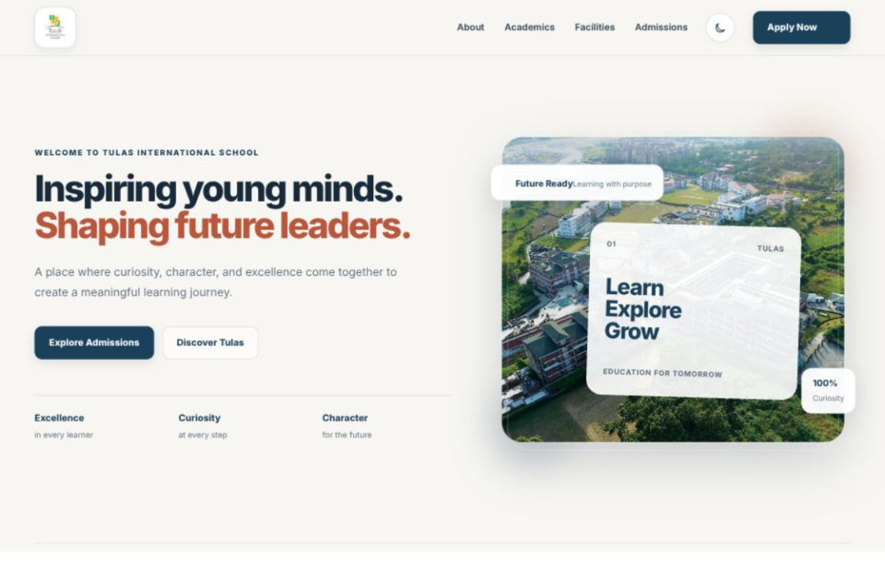

# Tulas International School Homepage

A responsive, single-page homepage concept for Tulas International School (TIS). The interface combines an editorial-style layout, school-focused content, a deep-blue and warm-ivory palette, terracotta accents, and clear links to the official admissions portal.

> This repository contains a frontend website concept. It does not include a CMS, admissions processing, authentication, or a project-owned API or database.

## Project links

- **Repository:** [github.com/Kishore-83096/netpuppy](https://github.com/Kishore-83096/netpuppy)
- **School website:** [tis.edu.in](https://tis.edu.in/)
- **Admissions portal:** [admission.tis.edu.in](https://admission.tis.edu.in)
- **Live demo:** https://netpuppy-eta.vercel.app/

## Live demo preview

This preview image is now used as the main visual for the live demo link and social sharing card:



## User interface

The homepage is composed in this order:

1. **Sticky navigation** — the school logo, links to page sections, a responsive menu, a theme switch, and an admissions call to action.
2. **Hero** — introductory message, links to admissions and the About section, school image, and animated feature cards.
3. **About** — a short description of the school's approach to education.
4. **Academics** — three visual cards describing academic excellence, holistic development, and future readiness.
5. **Facilities** — cards for classrooms, sports, and technology, with supporting images.
6. **Student experience** — a Discover, Connect, and Grow overview.
7. **Admissions** — a call to action linking to the official admissions portal.
8. **Footer** — school identity and links to the page sections.

### Visual design and interaction

- Inter is used for headings and body text. It is loaded through Next.js `next/font`.
- Shared CSS variables define the palette, typography, spacing, borders, shadows, and corner radii.
- Light theme is the default. The header's theme button switches between light and dark appearances; the selection is stored in the browser's `localStorage` under `tis-theme`.
- Motion provides entrance reveals, the scroll-progress bar, and subtle movement in selected hero and admissions elements.
- The custom pointer and click ring are enabled only for mouse-like pointers. They are not used on touch-first devices.
- Layout breakpoints in the global stylesheet adapt the page for tablet, mobile, and small-phone widths.
- Keyboard focus styles and the `prefers-reduced-motion` setting are supported.
- The navigation and hero links scroll to page sections. The admissions calls to action lead to `https://admission.tis.edu.in`.

## Technology

- **Framework:** Next.js 16 App Router
- **UI:** React 19 and TypeScript
- **Styling:** Global CSS (Tailwind CSS is present in the PostCSS toolchain, but the page's component styling is authored in `app/globals.css`)
- **Animation:** Motion for React, imported from `motion/react`
- **Font:** Inter via `next/font`
- **Package manager:** npm, using the committed `package-lock.json`

## Download and install

### Requirements

- **Node.js 20.9.0 or newer** and npm. Download the Node.js LTS installer from [nodejs.org/en/download](https://nodejs.org/en/download/); npm is included with Node.js.
- **Git**, if you want to use the clone commands below. Download Git from [git-scm.com/downloads](https://git-scm.com/downloads).

After installing, open a new terminal and check that they are available:

```bash
node --version
npm --version
git --version
```

The Git command is only needed for the clone option. If you choose the ZIP download option, you can download the files using a browser or PowerShell instead.

### Clone from GitHub

Open PowerShell, Command Prompt, or a terminal in VS Code. Move to the folder where you want the project downloaded, then run:

```bash
git clone https://github.com/Kishore-83096/netpuppy.git
cd .\netpuppy
npm ci
```

`git clone` downloads the repository into a new `netpuppy` folder. `cd` enters that folder. `npm ci` downloads and installs the project's exact dependency versions from `package-lock.json`.

### Download as a ZIP (without Git)

**Using the GitHub website:**

1. Open the [netpuppy repository](https://github.com/Kishore-83096/netpuppy).
2. Select the green **Code** button, then select **Download ZIP**.
3. When the download finishes, extract the ZIP archive.
4. Open a terminal in the extracted `netpuppy-master` folder (the folder containing `package.json`) and run:

   ```bash
   npm ci
   ```

**Using PowerShell commands:**

Open PowerShell in the folder where you want the project, then run these commands one at a time:

```powershell
Invoke-WebRequest -Uri "https://github.com/Kishore-83096/netpuppy/archive/refs/heads/master.zip" -OutFile "netpuppy.zip"
Expand-Archive -Path ".\netpuppy.zip" -DestinationPath "."
Set-Location ".\netpuppy-master"
npm ci
```

The first command downloads the ZIP from GitHub; the second extracts it; the third enters the extracted project folder; and the last installs the project dependencies.

After either download method and dependency installation, start the app with `npm run dev` and visit [http://localhost:3000](http://localhost:3000).

### Start the development server

```bash
npm run dev
```

Open [http://localhost:3000](http://localhost:3000). Changes to application files are picked up by the Next.js development server.

### Available commands

| Command | Purpose |
| --- | --- |
| `npm run dev` | Start the local development server. |
| `npm run lint` | Run ESLint checks. |
| `npm run build` | Create a production build. |
| `npm run start` | Serve the production build; run `npm run build` first. |

There is no test script configured in `package.json` at this time.

## Application structure

```text
.github/
  workflows/
    ci.yml
app/
  favicon.ico
  globals.css
  layout.tsx
  page.tsx
components/
  animation/
    CustomCursor.tsx
    Reveal.tsx
    ScrollProgress.tsx
  layout/
    Footer.tsx
    Navbar.tsx
  sections/
    About.tsx
    Academics.tsx
    Admissions.tsx
    Facilities.tsx
    Hero.tsx
    StudentExperience.tsx
  ui/
    Button.tsx
    SectionHeading.tsx
public/
  architecture-diagram.png
  diagram.png
  file.svg
  globe.svg
  next.svg
  vercel.svg
  window.svg
.gitignore
AGENTS.md
CLAUDE.md
eslint.config.mjs
next.config.ts
next-env.d.ts
package.json
package-lock.json
postcss.config.mjs
tsconfig.json
README.md
```

### Architecture diagram

The diagram below is the image saved in `public/diagram.png`. It gives a quick visual map of the project's main folders and how the homepage is put together. The `app/` folder starts the page, `components/` contains the reusable parts, and `public/` holds images and other static files.


You can also view the live diagram generated by GitDiagram (click the image to open its project page):

[](https://gitdiagram.com/kishore-83096/netpuppy?utm_source=readme&utm_medium=picture)

## How the project fits together

Think of the project as a few simple layers:

1. **The browser requests the homepage.** Next.js starts with `app/layout.tsx`, which provides the shared HTML document, page title and description, font, and global CSS.
2. **The page chooses what to show.** `app/page.tsx` imports and places the navigation, animation helpers, content sections, and footer in display order. This is the homepage's assembly point.
3. **Components render each part.** Files in `components/sections/` render the actual school content. Shared UI components keep buttons and headings consistent. The layout components provide the navigation and footer.
4. **CSS controls the appearance.** `app/globals.css` defines shared color and spacing variables, component styles, responsive rules, and light/dark theme colors. Components use those styles through class names.
5. **Client-side behavior runs in the browser.** Interactive components marked with `"use client"` handle behavior that needs browser APIs or user interaction, such as the mobile menu, saved theme preference, pointer effects, scroll position, and animations.
6. **Static and remote assets are displayed.** Files in `public/` can be served directly by the app. This homepage also loads school images and its logo from TIS and facility photos from Unsplash.

In short: **layout provides the shared frame → page assembles the homepage → components render the content → CSS styles it → the browser runs the interactive parts.**

### Application and component files

| File or folder | Context and reason |
| --- | --- |
| `.github/workflows/ci.yml` | GitHub Actions workflow that installs dependencies, runs lint and a production build, then builds and deploys the site to Vercel production. See [Continuous integration and deployment](#continuous-integration-and-deployment). |
| `app/layout.tsx` | Defines the root HTML layout, page metadata, Inter font setup, and global stylesheet import. |
| `app/page.tsx` | Assembles the homepage from the shared animation, layout, and section components. Change this file to reorder or add homepage sections. |
| `app/globals.css` | Holds the global reset, design tokens, component styles, light/dark theme colors, responsive layouts, and reduced-motion rules. The CSS variables keep the appearance consistent across sections. |
| `app/favicon.ico` | Browser tab and bookmark icon served by the App Router. |
| `components/animation/Reveal.tsx` | Reusable Motion wrapper that fades and moves content into view once it enters the viewport. |
| `components/animation/ScrollProgress.tsx` | Renders the fixed progress indicator linked to the page's scroll position. |
| `components/animation/CustomCursor.tsx` | Adds the decorative mouse pointer and click ring on devices with a fine pointer; disables that behavior for touch pointers. |
| `components/layout/Navbar.tsx` | Owns the sticky header, section navigation, mobile-menu state, and light/dark theme control and persistence. |
| `components/layout/Footer.tsx` | Renders the school identity, footer navigation, and copyright line. |
| `components/sections/Hero.tsx` | Renders the headline, introductory copy, hero calls to action, and animated visual. |
| `components/sections/About.tsx` | Presents the school's introductory statement and learning approach. |
| `components/sections/Academics.tsx` | Defines and renders the three academic feature cards. |
| `components/sections/Facilities.tsx` | Defines and renders the three campus/facility cards and their images. |
| `components/sections/StudentExperience.tsx` | Defines and renders the Discover, Connect, and Grow items. |
| `components/sections/Admissions.tsx` | Presents the admissions message and links to the official application portal. |
| `components/ui/Button.tsx` | Shared link styled as a button, with optional styling and click behavior. |
| `components/ui/SectionHeading.tsx` | Shared eyebrow-and-title heading used by content sections. |
| `public/` | Static files served from the site root. It includes the project architecture diagram and default Next.js starter SVGs; the starter SVGs are not currently referenced by the homepage components. |

### Project configuration and support files

| File | Context and reason |
| --- | --- |
| `package.json` | Declares project dependencies and the `dev`, `lint`, `build`, and `start` scripts. |
| `package-lock.json` | Locks npm dependency versions so installs are repeatable. |
| `next.config.ts` | Configures Next.js, including the remote image host used for Unsplash images. |
| `tsconfig.json` | Configures TypeScript, strict checks, JSX handling, and the `@/*` import alias. |
| `postcss.config.mjs` | Connects Tailwind CSS 4 to the PostCSS pipeline. |
| `eslint.config.mjs` | Enables the Next.js Core Web Vitals and TypeScript ESLint rules. |
| `.gitignore` | Excludes dependencies, build output, local environment files, and generated artifacts from Git. |
| `next-env.d.ts` | Next.js-generated TypeScript declarations; do not edit by hand. |
| `AGENTS.md` | Provides repository-specific instructions for coding agents working with this Next.js version. |
| `CLAUDE.md` | Points to the shared agent instructions in `AGENTS.md`. |

## Continuous integration and deployment

The workflow file is named `ci.yml` (not `ci.yaml`) and lives at `.github/workflows/ci.yml`. GitHub Actions reads this file to automate checks and deployment when code is pushed or a pull request is opened against the `master` branch.

The workflow runs these steps on an Ubuntu machine:

1. Checks out the repository and sets up Node.js 22 with npm dependency caching.
2. Runs `npm ci` to install the exact packages in the lockfile.
3. Runs `npm run lint` to check code style and common issues.
4. Runs `npm run build` to confirm Next.js can make a production build.
5. Installs the Vercel command-line tool, fetches the production project settings, builds Vercel's production artifacts, and deploys those artifacts to Vercel production.

For the Vercel steps to work, the GitHub repository needs these **Actions secrets** configured:

- `VERCEL_TOKEN` — the token used to authenticate the Vercel CLI.
- `VERCEL_ORG_ID` — the Vercel account or team identifier.
- `VERCEL_PROJECT_ID` — the Vercel project identifier.

**Important:** As currently written, all the Vercel steps run for both pushes and pull requests targeting `master`. That means a pull request can attempt a production deployment too (and may fail if its workflow does not have access to the required secrets). If pull requests should only run lint/build checks, the workflow needs a deployment condition or a separate deploy job before relying on it for production.

## Images and external services

The school logo and several school images are loaded from `tis.edu.in`; facility photos are loaded from Unsplash. The application does not bundle these remote images, so an internet connection is needed to display them. Remote URLs can change or become unavailable independently of this repository. Check image availability and usage rights before publishing.

The web font is fetched/handled through Next.js font tooling. A network connection may be required when setting up or building in a clean environment, depending on the font cache.

## Deployment

This is a standard Next.js application and can be deployed to Vercel or another host that supports the Next.js production runtime.

For a local production check:

```bash
npm run build
npm run start
```

For Vercel, import the GitHub repository and use the detected Next.js settings. After deployment, verify the responsive navigation, theme switch, external images, section links, and admissions destination.
