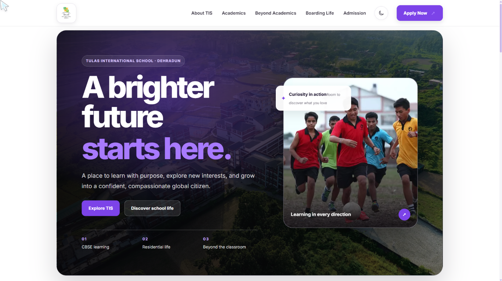
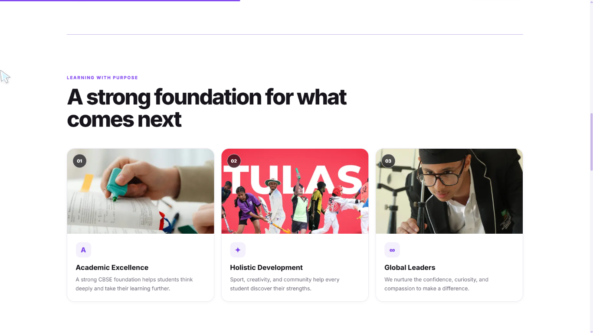
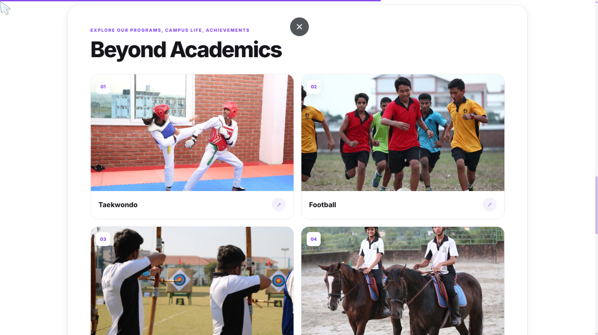
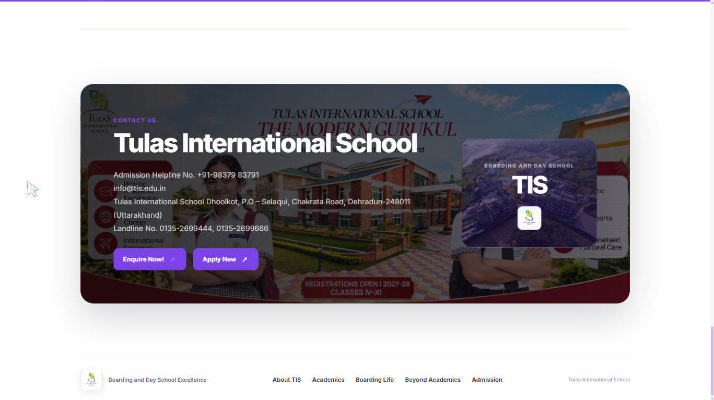
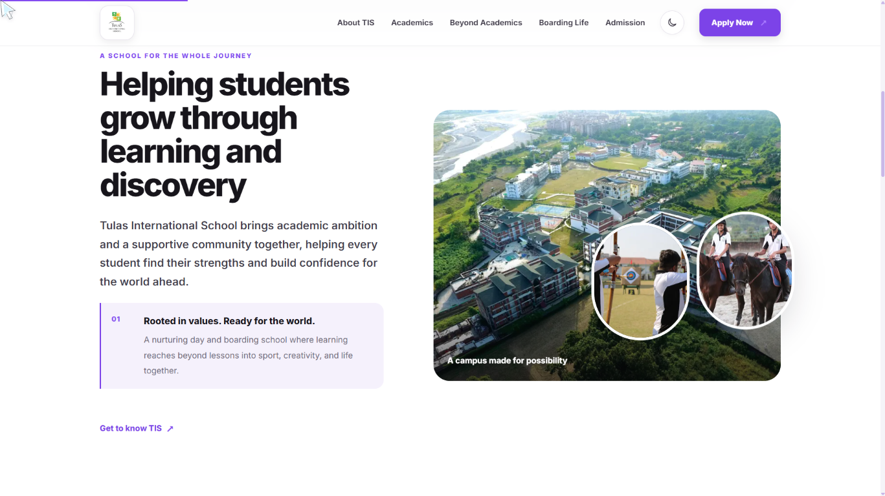
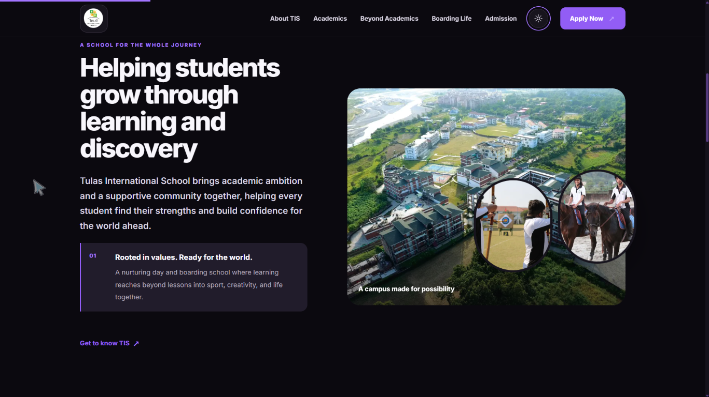

# Tulas International School (TIS) Homepage Redesign

A completed, responsive single-page homepage redesign for Tulas International School. This frontend assessment project presents the school's academics, boarding life, activities, and admissions information in a refreshed interface.

> This project is a frontend website concept. It does not provide a CMS, admissions processing, authentication, or a project-owned API or database.

## Project links

- **[Live demo](https://netpuppy-eta.vercel.app/)**
- **[Repository](https://github.com/Kishore-83096/netpuppy)**
- **[TIS website](https://tis.edu.in/)**
- **[Admissions](https://admission.tis.edu.in/)**

## Standout features

- **Custom Cursor:** A decorative cursor and click ring enabled for fine-pointer/mouse devices. It does not replace or interfere with touch/mobile interaction.
- **Scroll-Triggered Reveals:** Content animates into view as visitors scroll through the page.
- **Light/Dark Theme Switcher:** Switches the page theme and saves the preference in the browser.
- **Scroll Progress Bar:** Shows the visitor's progress through the page.

The interface also supports keyboard focus styles and the `prefers-reduced-motion` setting.

## Technology

- **Framework:** Next.js App Router
- **UI:** React and TypeScript
- **Styling:** CSS in `app/globals.css`, using the project's existing global styles and design tokens
- **Animation:** Motion for React, imported from `motion/react`
- **Font:** Inter via `next/font`
- **Deployment:** Vercel
- **Package manager:** npm

## Application architecture

| Directory | Purpose |
| --- | --- |
| `app/` | App Router entry points. `layout.tsx` provides shared metadata, font setup, and global CSS; `page.tsx` assembles the homepage. |
| `components/layout/` | Shared page layout elements: the navigation and footer. |
| `components/sections/` | Homepage content sections, including Hero, About TIS, Academics, Boarding Life, Beyond Academics, and Admission. |
| `components/animation/` | Reusable animation and scroll effects, including the custom cursor, reveal wrapper, and scroll progress bar. |
| `components/ui/` | Shared interface elements such as buttons and section headings. |
| `public/` | Static images and other assets served by the application. |

The global stylesheet contains shared design tokens, component styles, responsive rules, and light/dark theme colors.

## Getting Started

Requirements: Node.js 20.9 or newer and npm.

```bash
git clone https://github.com/Kishore-83096/netpuppy.git
cd netpuppy
npm install
npm run dev
```

The local development server is available at `http://localhost:3000`.

## Production verification

The following commands were used to check code quality and production build readiness:

```bash
npm run lint
npm run build
```

No automated test script is configured in the project.

## Responsive verification

The homepage was manually checked at 375px mobile, 768px tablet, 1280px desktop, and 1440px desktop widths. The browser console and network checks showed no console warnings or errors, missing resources, or hydration errors; images loaded correctly and responsive behavior worked as expected.

## Screenshots

<table>
  <tr>
    <th align="center">Homepage</th>
    <th align="center">Academics</th>
  </tr>
  <tr>
    <td align="center"></td>
    <td align="center"></td>
  </tr>
  <tr>
    <th align="center">Beyond Academics</th>
    <th align="center">Admissions</th>
  </tr>
  <tr>
    <td align="center"></td>
    <td align="center"></td>
  </tr>
</table>

## Theme previews

<table>
  <tr>
    <th align="center">Light mode</th>
    <th align="center">Dark mode</th>
  </tr>
  <tr>
    <td align="center"></td>
    <td align="center"></td>
  </tr>
</table>
