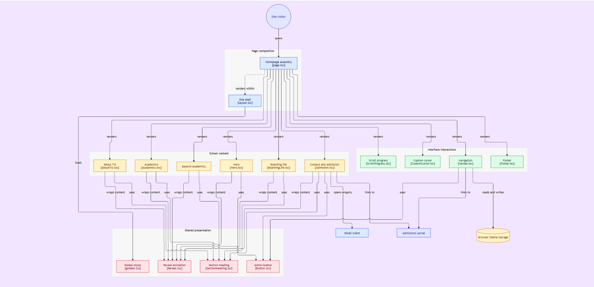

# Supplementary Project Documentation

This document contains additional implementation notes for the Tulas International School homepage redesign. For project links, setup instructions, technologies, and verification results, see [README.md](./README.md).

## Implementation status

| Requirement | Status | Notes |
| --- | --- | --- |
| Build a single-page TIS homepage | Implemented | The page includes Hero, About TIS, Academics, Boarding Life, Beyond Academics, Admission, and footer content. |
| Retain TIS identity and core content | Implemented in the redesign | Uses TIS branding and school imagery; this is a redesigned landing page, not a copy of the entire official website. |
| Use a modern frontend framework, styling, and animation | Implemented | Built with Next.js, React, TypeScript, CSS, and Motion for React. |
| Organize reusable components and semantic page structure | Implemented | Content is divided among section, layout, UI, and animation components. |
| Include standout features | Implemented | Custom cursor, scroll-triggered reveals, light/dark theme switcher, and scroll progress bar. |
| Support mobile, tablet, and desktop layouts | Manually verified | Checked at 375px, 768px, 1280px, and 1440px; responsive behavior worked as expected. |
| Provide calls to action | Implemented | Apply Now links to the official admissions portal; Enquire Now opens an email to TIS. |
| Provide project setup and documentation | Implemented | README covers project links, technologies, setup, architecture, and verification. |
| Check lint and production build | Verified | `npm run lint` and `npm run build` are documented as the project's verification commands. |

## Homepage sections

The homepage is assembled in this order:

1. **Navigation** — school logo, section links, responsive menu, theme switch, and admissions call to action.
2. **Hero** — introductory message, calls to action, football image, and floating badge and image caption.
3. **About TIS** — school introduction, expandable details, campus imagery, and archery and horse-riding photos.
4. **Academics** — CBSE curriculum, academic excellence, holistic development, and preparing students to be global leaders.
5. **Boarding Life** — information about a community that encourages leadership, innovation, and lifelong learning.
6. **Beyond Academics** — activity cards for Taekwondo, Football, Archery, and Horse Riding.
7. **Contact and admission** — TIS contact details, enquiry email link, and official admissions portal link.
8. **Footer** — school identity and links to homepage sections.

## Visual design and interaction

- Inter is used for headings and body text through Next.js `next/font`.
- Shared CSS variables define the palette, typography, spacing, borders, shadows, and corner radii.
- The light theme is the default. The navigation theme control switches between light and dark appearances and saves the preference in `localStorage` under `tis-theme`. Dark mode adjusts the hero floating badge text for contrast.
- Motion provides entrance reveals, the scroll progress bar, and gentle floating movement for the hero caption and badge and the About section's archery and horse-riding photos.
- The responsive navigation shows a themed background when its tablet/mobile menu is open.
- The About section includes a Read more disclosure; Boarding Life topics expand when selected.
- The custom pointer and click ring are limited to fine-pointer/mouse devices and do not interfere with touch interaction.
- Global stylesheet breakpoints adapt the layout for tablet, mobile, and small-phone widths. Keyboard focus styles and `prefers-reduced-motion` are supported.
- Homepage copy and section labels follow the current TIS homepage, and admissions calls to action lead to [the official admissions portal](https://admission.tis.edu.in/).

## How the application is organized

1. `app/layout.tsx` provides the shared HTML document, page metadata, font setup, and global stylesheet.
2. `app/page.tsx` assembles the navigation, animation components, homepage sections, and footer.
3. Components in `components/sections/` render school content. Shared UI components provide consistent buttons and headings; layout components provide the navigation and footer.
4. `app/globals.css` defines shared design tokens, component styles, responsive rules, and light/dark theme colors.
5. Client components handle browser-dependent behavior and interaction, including the mobile menu, saved theme preference, pointer effects, scroll position, and animations.
6. Static assets in `public/` are served directly by the app; the homepage uses locally bundled school imagery and branding.

### Component reference

| File | Purpose |
| --- | --- |
| `app/layout.tsx` | Root layout, page metadata, Inter font setup, and global stylesheet import. |
| `app/page.tsx` | Homepage assembly point. |
| `app/globals.css` | Global reset, design tokens, component styles, theme colors, responsive layouts, and reduced-motion rules. |
| `components/animation/Reveal.tsx` | Motion wrapper that reveals content when it enters the viewport. |
| `components/animation/ScrollProgress.tsx` | Fixed progress indicator linked to page scroll position. |
| `components/animation/CustomCursor.tsx` | Decorative cursor and click ring for fine-pointer devices. |
| `components/layout/Navbar.tsx` | Sticky header, section navigation, mobile menu, and theme control and persistence. |
| `components/layout/Footer.tsx` | School identity, footer navigation, and copyright line. |
| `components/sections/Hero.tsx` | Introductory headline, copy, calls to action, and animated visual. |
| `components/sections/AboutTIS.tsx` | TIS introduction, expandable details, and campus and activity imagery. |
| `components/sections/Academics.tsx` | CBSE curriculum feature cards. |
| `components/sections/BeyondAcademics.tsx` | Taekwondo, Football, Archery, and Horse Riding activity cards. |
| `components/sections/BoardingLife.tsx` | Expandable Boarding Life topics. |
| `components/sections/Admission.tsx` | TIS contact details, enquiry link, and official application portal link. |
| `components/ui/Button.tsx` | Shared link styled as a button. |
| `components/ui/SectionHeading.tsx` | Shared eyebrow-and-title section heading. |

## Architecture diagram

The diagram illustrates the homepage flow, shared styles and components, navigation, animations, and admissions links. It is stored locally at `public/diagram.png`.



An [interactive architecture diagram](https://gitdiagram.com/kishore-83096/netpuppy) is also available.

## Static assets and external services

Homepage imagery and branding are stored in `public/` and served by the application. The font is configured through Next.js font tooling; a network connection may be needed in a clean environment when the font is not cached.

## Continuous integration and deployment

The GitHub Actions workflow at `.github/workflows/ci.yml` runs on pushes and pull requests targeting `master`. It checks out the repository, sets up Node.js 22, installs dependencies with `npm ci`, and runs lint and production build checks. It then pulls Vercel production settings, builds production artifacts, and deploys to Vercel.

The Vercel workflow steps require these GitHub Actions secrets:

- `VERCEL_TOKEN`
- `VERCEL_ORG_ID`
- `VERCEL_PROJECT_ID`

Because the deployment steps are not restricted to pushes, a pull request targeting `master` also attempts a production deployment. A deployment condition or separate deploy job would be needed to limit production deployment to pushes.

The Next.js application can be deployed to Vercel or another host that supports the Next.js production runtime. To run a local production build:

```bash
npm run build
npm run start
```
